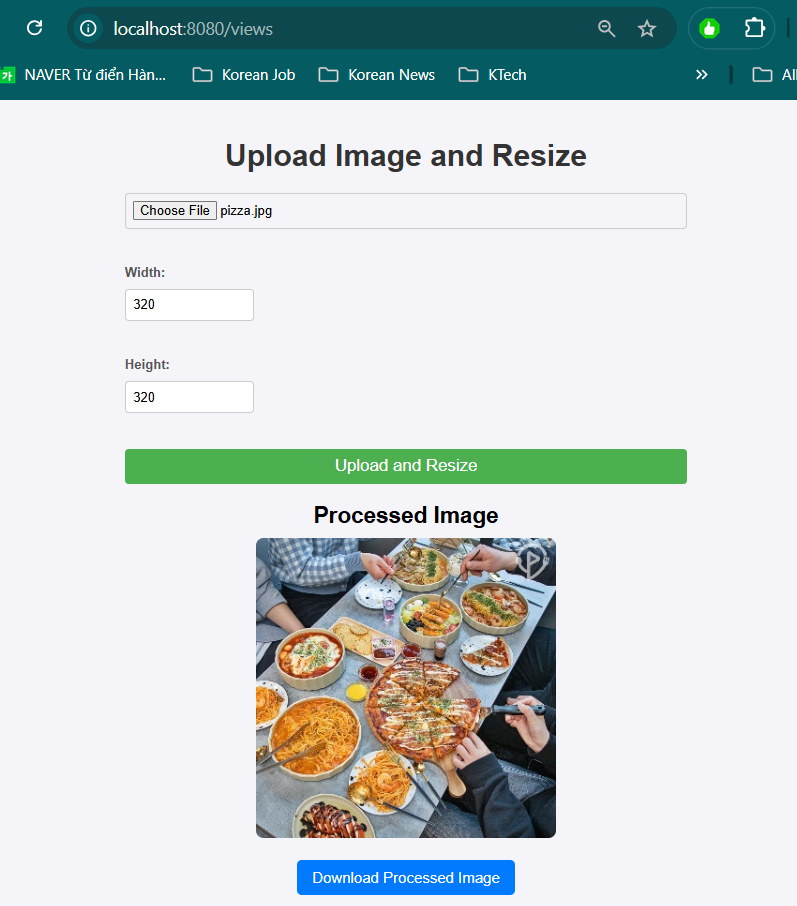

# Image Upload and Resize Web Application

This web application allows users to upload an image, specify custom dimensions (width and height), and receive a resized image in response.

## Features

- Upload an image file.
- Specify width and height for resizing.
- The server resizes the image and returns the resized image.
- Download the processed image.

## How It Works

1. **Upload Image**: The user selects an image file from their device using the file input.
2. **Set Dimensions**: The user can enter the desired width and height for the resized image.
3. **Processing the Image**: Upon form submission, the image and specified dimensions are sent to the server.
4. **Display Resized Image**: The server processes the image using Flask (Python, OpenCV), resizes it, and returns the resized image URL.
5. **Download**: The user can download the resized image by clicking the download link.

## Tech Stack

- **Frontend**: HTML, CSS, JavaScript
- **Backend**: Spring Boot (Java) for serving the web interface
- **Image Processing**: Flask (Python) using OpenCV (cv2)
- **File Handling**: Multipart file uploads

